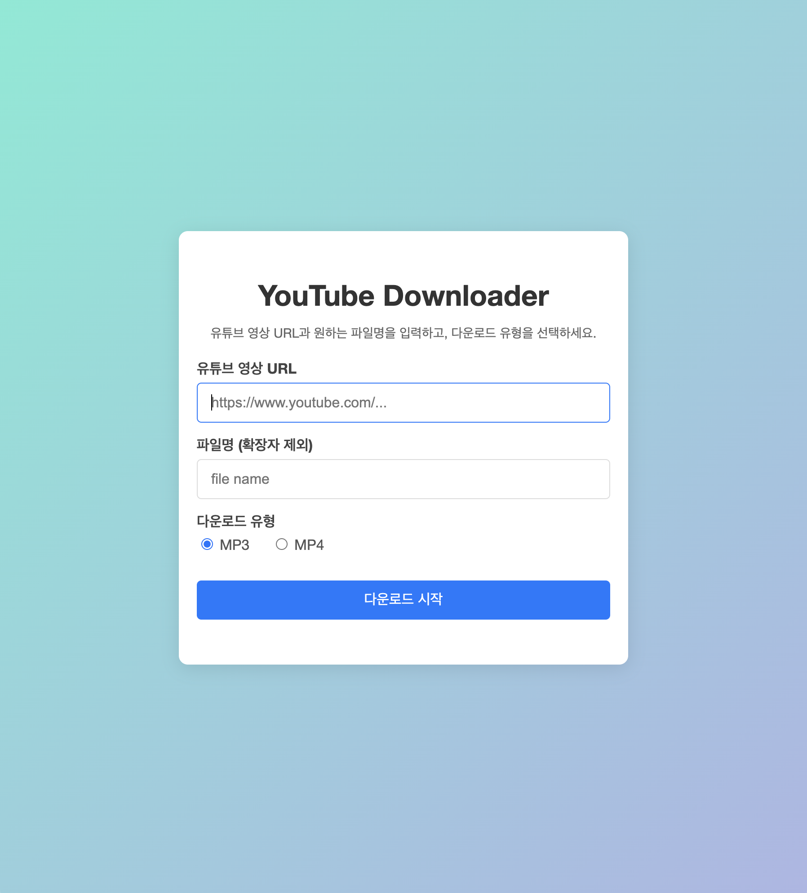

# yt-downloader



**yt-downloader**는 Express와 [youtube-dl-exec](https://www.npmjs.com/package/youtube-dl-exec)을 이용하여 유튜브 영상에서 음원(MP3) 또는 영상(MP4)을 스트리밍 방식으로 다운로드 받을 수 있는 웹 애플리케이션입니다.  
사용자는 브라우저에서 유튜브 URL과 원하는 파일명을 입력하고, 라디오 버튼을 통해 MP3 또는 MP4 중 한 종류만 선택하여 다운로드할 수 있습니다.

> **주의:**  
> 이 프로젝트는 교육용 예제입니다.  
> 유튜브와 같은 플랫폼에서 저작권 보호 콘텐츠를 다운로드하는 행위는 해당 서비스의 이용 약관 및 저작권법에 위배될 수 있습니다.  
> 본 프로젝트의 코드를 상업적 또는 불법적인 목적으로 사용하지 마시고, 사용 전 반드시 법적 검토를 진행해 주세요.

## 주요 기능

- **유튜브 URL 입력:** 사용자가 유튜브 영상 URL을 입력합니다.
- **파일명 지정:** 사용자가 원하는 파일명을 직접 입력할 수 있습니다.
- **다운로드 유형 선택:** 라디오 버튼을 통해 MP3 또는 MP4 중 한 종류만 선택 가능
- **스트리밍 다운로드:** 서버는 youtube-dl-exec를 이용하여 임시 파일로 다운로드한 후, 그 파일을 읽어 브라우저에 스트리밍 방식으로 전송합니다.
- **브라우저 다운로드 대화상자:** 클라이언트는 응답받은 파일을 일반적인 브라우저 다운로드 방식으로 저장

## 기술 스택

- **서버:** Node.js, Express, body-parser
- **프론트엔드:** HTML, CSS, JavaScript (Fetch API)
- **프로세스 관리 (옵션):** [PM2](https://pm2.keymetrics.io/)

## 설치 및 실행

### 1. 클론 및 의존성 설치

```bash
git clone https://github.com/luvaction/yt-downloader.git
cd yt-downloader
npm install
```

### 2. 일반 실행

서버는 기본적으로 포트 `3001`에서 실행됩니다.

```bash
node app.js
```

### 3. PM2를 사용한 실행 (개발 및 배포)

PM2를 사용하면 Node.js 애플리케이션을 백그라운드에서 안정적으로 실행하고, 코드 변경 시 자동으로 재시작할 수 있습니다.

#### PM2 전역 설치

```bash
npm install -g pm2
```

#### PM2로 앱 실행 (코드 변경 시 자동 재시작)

```bash
npm run pm2-dev
```

위 명령은 `package.json`에 설정된 `"pm2-dev"` 스크립트를 실행하여, 앱을 PM2로 실행하고 코드 변경 시 자동 재시작(watch)을 활성화합니다.

#### PM2 관리 명령어

- 실행 중인 프로세스 확인:
  ```bash
  pm2 list
  ```
- 로그 보기:
  ```bash
  pm2 logs yt-downloader-web
  ```
- 앱 재시작:
  ```bash
  pm2 restart yt-downloader-web
  ```
- 앱 중지:
  ```bash
  pm2 stop yt-downloader-web
  ```
- 앱 삭제:
  ```bash
  pm2 delete yt-downloader-web
  ```

## 배포 팁

- **서버 환경 준비:**  
  Linux 서버나 클라우드 환경(AWS, DigitalOcean, Heroku 등)에 Node.js를 설치한 후, 이 프로젝트를 클론하여 실행할 수 있습니다.
- **도메인 및 HTTPS 설정:**  
  Nginx 또는 Apache를 리버스 프록시로 사용해 도메인을 연결하고, Let's Encrypt 등을 통해 HTTPS를 설정하세요.
- **환경 변수 관리:**  
  포트 번호, 로그 레벨, 파일 저장 경로 등은 환경 변수 또는 별도의 설정 파일로 관리하면 좋습니다.
- **보안 강화:**  
  Express 서버에 Helmet, CORS 등의 보안 미들웨어를 적용하고, 사용자 입력에 대한 유효성 검사를 철저히 하세요.
- **모니터링:**  
  PM2의 모니터링 기능을 사용하거나 외부 모니터링 서비스를 이용해 앱의 상태를 주기적으로 확인하세요.

## 파일 구조

```
yt-downloader/
├── app.js               # Express 서버 설정 및 다운로드 엔드포인트 구현
├── downloader.js        # youtube-dl-exec를 이용한 스트리밍 다운로드 및 제목 추출 함수
├── package.json         # 프로젝트 의존성, 실행 스크립트 및 PM2 설정
├── public/
│   ├── index.html       # 다운로드 UI (HTML)
│   └── styles.css       # UI 스타일 (CSS)
└── README.md            # 이 파일
```

## 기여

이 프로젝트에 기여하고 싶으시면 Pull Request 또는 이슈를 남겨주세요.

## 라이선스

이 프로젝트는 MIT 라이선스에 따라 배포됩니다. 자세한 내용은 [LICENSE](./LICENSE) 파일을 참조하세요.

## 연락처

개발 관련 문의는 GitHub 이슈를 통해 의견을 남겨주세요.
